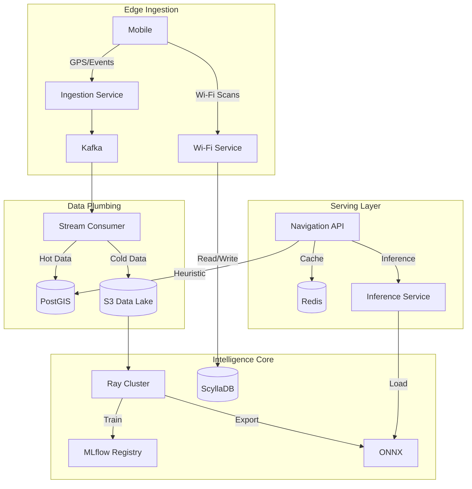

# Vectra: Enterprise Last-Mile Navigation Intelligence 

**Vectra** is an enterprise-grade AI platform designed to solve the "Last 100 Meters" problem in logistics. It consumes raw telemetry (GPS traces, motion states, Wi-Fi scans) to predict the optimal **Navigation Point (NP)** for vans to park and the precise **Entry Point (EP)** for drivers to access buildings.

---

## High-Level Architecture

Vectra evolves from heuristic baselines to probabilistic AI models using a hybrid batch/stream architecture.



---

## Key Features

- **Trace Mining:** Converts raw noisy GPS streams into structured delivery events.
- **Map Matching:** Snaps floating GPS points to the correct road network and lane using OSRM and Bearing logic.
- **Indoor Positioning:** Uses Wi-Fi Fingerprinting (KNN + ScyllaDB) to locate drivers in urban canyons or indoors.
- **Probabilistic AI:**
  - **GNN (Graph Neural Networks):** Predicts parking spots based on road graph topology.
  - **GMM (Gaussian Mixture Models):** Identifies multi-modal building entrances (Front Door vs. Loading Dock).
- **Enterprise Scale:**
  - **Distributed Training:** Ray cluster for parallel model training per geohash.
  - **Low Latency:** ONNX Runtime for <10ms inference.
  - **Resilience:** Circuit Breakers, Fallback Heuristics, and Canary Routing.

---

## Technology Stack

| Domain            | Technologies                                                        |
| :---------------- | :------------------------------------------------------------------ |
| **Languages**     | Python 3.10+, SQL, CQL                                              |
| **Compute**       | Kubernetes (EKS), Ray, Docker                                       |
| **Streaming**     | Apache Kafka, FastAPI (Async)                                       |
| **Databases**     | PostGIS (Spatial), ScyllaDB (Wide-column), Redis (Cache), S3 (Lake) |
| **Geospatial**    | OSRM, Valhalla, GeoPandas, PyProj, Shapely, PyGeohash               |
| **AI / ML**       | PyTorch Geometric, Scikit-Learn, MLflow, ONNX Runtime, Feast        |
| **Observability** | Prometheus, Grafana, Structlog                                      |

---

## Repository Structure

```text
vectra-platform/
├── docker-compose.yml          # Local development stack
├── infrastructure/             # Terraform & K8s Manifests
│   ├── terraform/              # AWS EKS, MSK, RDS, VPC
│   └── cassandra/              # ScyllaDB Schemas
├── mlops/                      # AI Infrastructure
│   ├── feast/                  # Feature Store definitions
│   └── mlflow/                 # Model Registry
├── services/                   # Microservices
│   ├── ingestion-edge/         # High-throughput GPS ingestion
│   ├── stream-consumer/        # Kafka -> S3/PostGIS Sink
│   ├── refinery-worker/        # Heuristic Processing (Phase 2)
│   ├── model-training/         # Ray/PyTorch Training Pipelines (Phase 3)
│   ├── inference-service/      # ONNX Serving API (Phase 3)
│   ├── wifi-service/           # Indoor Positioning (Phase 4)
│   └── navigation-api/         # Main Gateway & Canary Router
└── scripts/                    # Utilities & Synthetic Data Generators
```

---

## Getting Started

### Prerequisites

- Docker & Docker Compose
- Python 3.10+
- Minikube or AWS Account (for K8s deployment)

### 1. Generate Project Scaffolding

Run the bootstrap script to create the directory structure and files.

```bash
python generate_project.py
```

### 2. Local Stack Initialization

Spin up the infrastructure (Postgres, Kafka, Redis, Scylla, Ray, MLflow).

```bash
docker-compose up -d
```

### 3. Initialize Databases

Apply schemas for PostGIS and ScyllaDB.

```bash
# PostGIS
docker exec -i vectra-postgis psql -U vectra -d vectra_core < scripts/init_db.sql
docker exec -i vectra-postgis psql -U vectra -d vectra_core < scripts/phase2_init_db.sql

# ScyllaDB (Wi-Fi)
docker exec -i vectra-scylla cqlsh < infrastructure/cassandra/schema.cql
```

### 4. Run Data Pipeline (Simulation)

We provide scripts to simulate a fleet of drivers and Wi-Fi scanners.

```bash
# 1. Simulates GPS Traces entering the Ingestion Service
python scripts/testbed_phase2.py

# 2. Simulates Wi-Fi Fingerprinting ingestion and lookup
python scripts/simulate_wifi_traffic.py

# 3. Triggers Synthetic Model Training (GMM/GNN)
python scripts/testbed_phase3.py
```

---

## 🔌 API Documentation

### 1. Ingestion Service (Port 8000)

**POST** `/api/v1/telemetry/proto`
Accepts binary Protobuf GPS traces.

```json
{
  "driver_id": "D-101",
  "latitude": 40.7128,
  "longitude": -74.006,
  "event_type": "STOP"
}
```

### 2. Navigation API (Port 8001)

**GET** `/api/v1/resolve/{geohash}`
Returns the optimal Navigation Point (NP) and Entry Point (EP).

- _Note:_ Uses Canary Routing (5% traffic hits AI, 95% hits Heuristics).

**Response:**

```json
{
  "address_id": "dr5ruj4",
  "navigation_point": { "lat": 40.7129, "lon": -74.0061 },
  "entry_point": { "lat": 40.7128, "lon": -74.0059 },
  "source": "canary_ai_Main Entrance",
  "confidence": 0.92
}
```

### 3. Wi-Fi Service (Port 8004)

**POST** `/locate`
Refines location when GPS is weak.

```json
{
  "latitude": 40.7128,
  "longitude": -74.006,
  "wifi_scan": { "aa:bb:cc:dd:ee:ff": -55 }
}
```

## Contributing

1.  Fork the repository.
2.  Create a feature branch (`git checkout -b feature/amazing-feature`).
3.  Commit your changes (`git commit -m 'Add amazing feature'`).
4.  Push to the branch (`git push origin feature/amazing-feature`).
5.  Open a Pull Request.

## License

Distributed under the MIT License. See `LICENSE` for more information.
